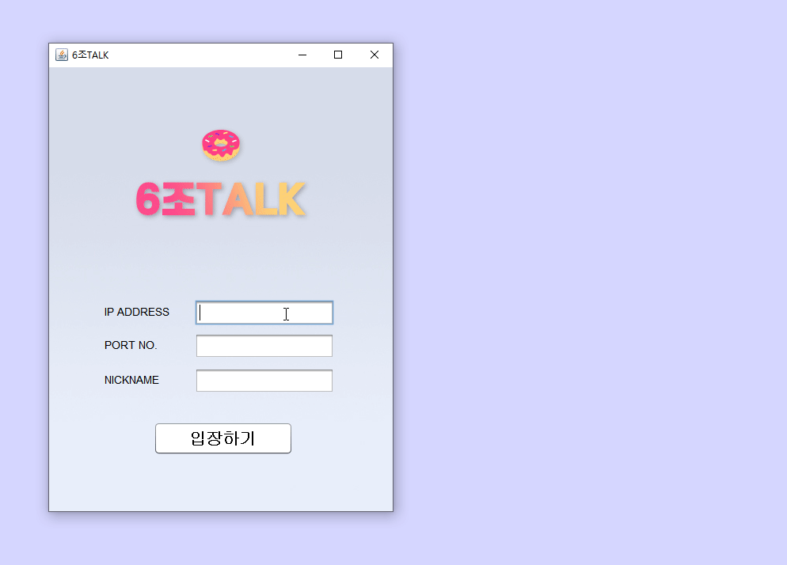

## 🍧 6조TALK
* 웹 소캣을 이용한 채팅 프로그램

## 📋 프로젝트 개요
* IP와 포트번호를 입력하여 채팅방에 입장할 수 있습니다.
* 다자가 입장하여 채팅을 할 수 있습니다.
* 현 채팅방에 입장한 사람을 확인할 수 있습니다.
* 채팅방에 입장한 사람의 기록(이름, 날짜)이 실시간으로 DB에 등록됩니다.

## 📅 프로젝트 기간
2020.12.30 ~ 2020.12.31

## 🛠 사용 언어 및 툴
* Eclipse
* JAVA
* OracleDB/SQL Developer